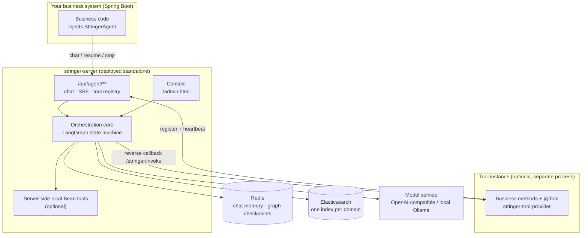
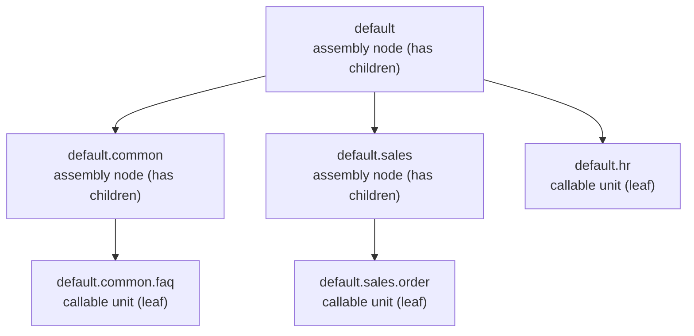
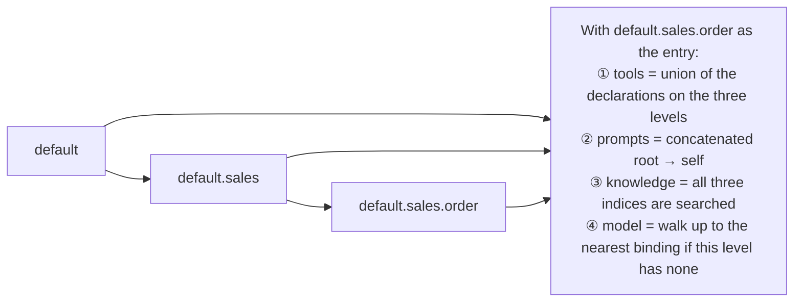
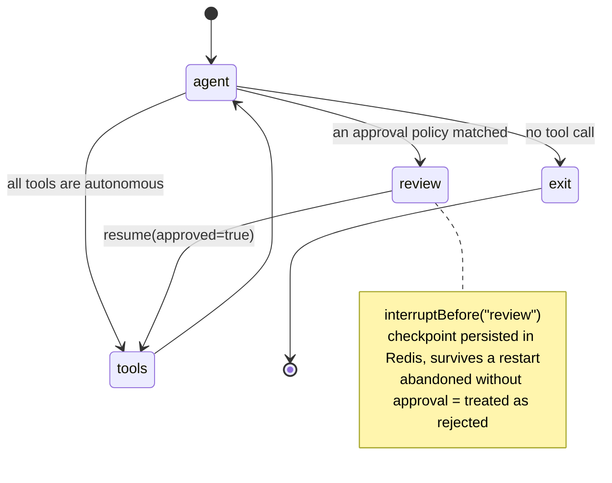

<h3 align="center">Stringer</h3>

<p align="center">
  <strong>Java agent runtime middleware. Orchestration, tool governance, knowledge base and the ops console run in one standalone server process —<br>while the tools stay in your own code.<br>One server + three opt-in SDKs: <code>forDomain(domain)</code> gets the chat entry, and every turn assembles tools / prompts / model / knowledge for that domain; <code>@Tool(domains=…)</code> lets the agent call your business methods inside your own process; the knowledge base SDK uploads documents into per-domain indexes.<br>Permission violations fail loudly instead of degrading silently; tool changes take effect on the next turn; approval checkpoints survive a server restart.</strong>
</p>

<p align="center">
  
  
  
  
</p>

<p align="center">
  
  
  
  
</p>

<p align="center">
  <a href="#why-choose-stringer">Why choose us</a>
  &nbsp;·&nbsp;
  <a href="#how-it-compares">Comparison</a>
  &nbsp;·&nbsp;
  <a href="#core-design-domains-and-assembly">Core design</a>
  &nbsp;·&nbsp;
  <a href="#quick-start">Quick start</a>
  &nbsp;·&nbsp;
  <a href="#who-it-s-for--who-it-isn-t">Who it's for</a>
  &nbsp;·&nbsp;
  <a href="#documentation">Documentation</a>
</p>

---

## Why choose stringer?

Building an agent inside an enterprise, the hard part is not hooking up a model — it is **making sure every end user, in this turn, sees exactly what they are supposed to see**. Platforms pin tools to an application at publish time and change them by shipping a new release; we do **per-request assembly** — the same service trims tools, prompts, model and knowledge for the domain passed on each turn, and **refuses out loud** when something is out of bounds.

**Your tools do not have to move.** A platform wants you to translate your methods into OpenAPI, a plugin or MCP; add a `@Tool` to a method, let the parameter schema be derived from the signature, and the tool stays in your business process where it can reach local transactions and intranet data directly.

**An out-of-bounds call is not "hidden".** Platforms usually drop an unavailable tool from the list quietly — the model never learns it exists, so it talks its way around it or makes something up. We refuse explicitly and feed the reason back to the model so it can find another route and finish on its own: `10001` outside the domain, `10004` domain does not exist, `10010` domain is not callable, `80001` tool is offline. **None of these falls back to the full tool set.**

**Configuration changes take effect on the next turn.** The tool set is read from the registry on every turn, with no cached snapshot. An instance tripping its fuse, going offline, or a new domain appearing needs no restart and no release.

**"No reply" means "rejected".** If a user abandons an approval interrupt by starting a new conversation, we treat it as a rejection, append a placeholder answer so the turn completes, and **delete the checkpoint** — that pending action is void forever, and no later resume can reach it. Checkpoints live in Redis, so they survive a server restart.

**A full memory says so instead of truncating.** The dual constraint (100 messages / 30k tokens) is append-only; on hitting the cap the session rejects the new round with `30004` and **zero side effects** — nothing written to memory, no checkpoint cleared, no model call. The platform does not swap `sessionId` for you, because that is business semantics.

**Multi-index retrieval does not get the maths wrong.** BM25's idf is computed within its own index, so pooling multi-route results and weighting them directly treats rare terms from a small index as top scores — the system returns normally and the ranking is entirely wrong. We use **score-based** fusion for a single source and switch to **RRF (rank-based)** automatically once several sources are involved (ranks only, inherently immune to cross-index incomparability), sharing weight evenly across modalities with empty tables taking no share. The Chinese `minimum_should_match` of 50% is not a guess, it is measured: 60% makes an ordinary question like "会员退款的时效说明" return nothing.

**Errors are programmable, not something you read Chinese for.** A uniform `ErrorCode` five-tuple carries `retryable`, so a client can decide between backoff-retry and surfacing a message without parsing prose. A streaming failure still has HTTP 200, and `code` is the only truth.

> A fuller comparison, including the boundaries we do **not** solve, is in [`docs/POSITIONING.md`](docs/POSITIONING.md).

---

## How it compares

Only dimensions that **differ** are listed; common ground (chat, streaming, multi-model access) is not repeated.

| Capability | Rolling your own on LangChain4j / Spring AI | Using a platform (Dify / FastGPT) | Stringer |
| --- | --- | --- | --- |
| Where tools come from | Write registration code, define the parameter schema yourself | Platform side: import OpenAPI / install a plugin / connect MCP | **Annotate a method with `@Tool`**; the parameter schema is derived from the method signature |
| Where tools run | Your process | Your service, or a bundled platform plugin | **Your process** (SDK registration + reverse callback) **or the server process** (local Bean, called in-process) |
| Domains and assembly | No such concept; design your own permission dimension | Isolation granularity is "app / workflow" | **Domain tree + two roles + four dimensions accumulating along the chain**: a parent domain provisions tools / prompts / model / knowledge for its descendants |
| Human approval | Implement interrupt, persistence and resume yourself | Arranged by the orchestration layer | `@Tool(approval=…)` **takes effect on declaration**; checkpoints in Redis, resumable after a server restart |
| Multi-instance tool governance | None | None (the platform side is a plugin marketplace) | **Registry**: whole-manifest reporting, automatic removal on disconnect, automatic restore on reconnect, per-instance mute / force-offline |
| Knowledge retrieval | Wire up a vector store, write recall and fusion yourself | Built into the platform | **One index per domain + domain-chain retrieval**; score-based for a single index, RRF automatically for several |
| Conversation memory | Implement it yourself | Built into the platform | Dual constraint (message count + token estimate), isolated per `(domain, sessionId)`; on hitting the cap it **refuses explicitly** rather than dropping history silently |
| Console and operations | None, build your own | The platform ships a UI | An 8-page console (domain space / fuse tool calls / knowledge base / prompts …) + a runtime metrics snapshot |
| Stack | Java (library, inside your business process) | A standalone platform (mostly Python) | Java 21 / Spring Boot, same stack as your business code |

- **New projects**: use Stringer as the foundation — orchestration, approval, the tool registry, the knowledge base and the console are there on day one, so you do not build that layer first.
- **Existing projects**: add the dependency, inject `StringerAgent`, and annotate an existing `@Service` method with `@Tool`; there is no need to restructure existing code for AI.

> The two competitor columns describe the mainstream shape at the time of writing, to help you locate the differences quickly; consult their current documentation for specifics.

## Core capabilities

| Capability | What it actually gives you |
| --- | --- |
| **State-graph orchestration** | Every step is explicitly controllable (`agent → conditional routing → tools/review → agent`), with transparent state, interrupt and resume |
| **Human-in-the-loop (HITL)** | Once a tool declares an approval policy, the call interrupts before execution and waits for confirmation; the interrupt point is persisted in Redis and **survives a server restart** |
| **Domains and assembly** | Every turn must declare the domain it runs in; the model only sees that domain's tools and only receives that domain's prompts. A domain is a tree, and a parent provisions the four things — **tools / prompts / model / knowledge** — for its descendants (see [Core design](#core-design-domains-and-assembly)) |
| **Remote tool registry** | Tool instances report their whole declaration on a heartbeat, and the server keeps a per-instance replica; an instance that drops off is removed, a reconnecting one is restored, and several instances of the same tool can be online at once |
| **Instance availability control** | The "Fuse tool calls" page can **mute (fuse) / restore / force-offline** a single instance: muting removes every tool replica that instance reports, with no need to touch the process it lives in; a force-offlined instance receives a 410 and stops heartbeating |
| **Hybrid retrieval (two-track fusion)** | Vector and keyword routes recall in parallel and are then fused and re-ranked. Results from a **single index** use **score-based** fusion (normalized weighting; a hit in the title or filename is a multiplicative boost); when the parent-domain chain contributes **several indices** it switches to **RRF (rank-based)** — BM25 scores are not comparable across indices, and only ranks are distortion-free. RRF splits weight evenly per modality and applies a level decay, so a domain's own knowledge outranks what it inherits |
| **One index per domain** | Each domain gets its own ES index (created on demand); retrieving in domain D queries only the indices on the "D + all ancestors" chain, the same accumulative semantics as tool visibility. Deleting a domain deletes its index. The console uploads per domain (by default `txt` / `md` / `markdown` / `docx` / `doc` / `pdf` / `xls` / `xlsx`, whitelist configurable), shows ingestion status and rebuilds a whole index; a missing ES IK analyzer is detected by "test connection" on the Storage page (three states: available / confirmed missing / not probed) |
| **Dual-constraint memory** | Caps both message count and estimated tokens, stored in Redis per `(domain, sessionId)`; **append-only, never evicts** — once full, the session rejects further rounds (`30004`) and the caller supplies a new `sessionId` |
| **Streaming and cancellation** | Events are pushed frame by frame; a running task can be stopped at any time |
| **Built-in console** | 8 pages: overview, models, storage, domain space, fuse tool calls, prompts, knowledge base, account |
| **Runtime metrics snapshot** | `GET /admin/metrics` returns registered tool count, running sessions, heap usage and core metric snapshots — ready for your existing monitoring collector (admin surface, credential required) |
| **Starts with zero configuration** | ES / Redis / models can all be missing at startup; a missing configuration is reported **at call time** with a pointer to the exact console page |

## Architecture



Each of the three roles has its place:

- **Business system** pulls in only `stringer-chat-client` (add `stringer-kb-client` if it uploads documents) and calls through `StringerAgent`, with no HTTP to assemble by hand.
- **Tools can live either place**: stay in the business process (add `stringer-tool-provider`, register on a heartbeat), or go straight into the server process (the server scans local `@Tool` beans). **The same annotated code moves between the two shapes without changing a character.**
- **The server** is the only stateful party: orchestration, checkpoints, the tool registry, knowledge base indices and the console all live there.

## Core design: domains and assembly

This is the most essential difference between Stringer and "calling a model API directly", and the place where getting it wrong costs the most.

**A domain is the scenario of one conversation**, and it decides four things at once: which tools the model can see, which system prompt is used, which knowledge can be retrieved, and which model is called.

A domain is a tree, identified by a **full path starting at the root domain `default`** (dot-separated, e.g. `default.sales.order`). The primary key and the display form are the same string, so there is no "same name, different parent" ambiguity.

### Two roles: callable unit / assembly node



Note that every node's identifier is **its parent path plus one segment**: `default.common.faq` sits under `default.common`, while `default.sales` sits under `default` (not under `default.common`) — the identifier *is* the path, so there is no "same name, different parent".

**Only a leaf domain can be a callable unit** — the moment a domain gains a child it is demoted to an assembly node. The root is no exception: with the whole tree being just the root it is callable, and once you build a child under it, it too is merely an assembly node.

In the diagram above, `default`, `default.common` and `default.sales` all have children, so all three are assembly nodes and none can be an entry point; the only valid entries are the three leaves: `default.common.faq`, `default.sales.order` and `default.hr`.

- **Callable unit** (leaf): can be an entry point — this is what you pass to `chat`.
- **Assembly node** (has children): **cannot be an entry point**; it only passes tools / prompts / model / knowledge down to its descendants. Passing one as an entry returns `10010` ("this domain is not a callable unit") instead of degrading quietly.
- When you need an entry point for "a whole level", **create another domain that has no children** rather than turning the parent itself into an entry point.
- This constraint is **derived on read** (`explicitly marked ∧ has no children`), so it cannot be bypassed no matter whether the mark came from the console, from a tool declaration, or from a historical file on disk.

A domain that does not exist returns `10004`, one that is not a callable unit returns `10010`, and it **never degrades silently to the full tool set**.

### Assembly: four things accumulate along the ancestor chain

A child domain inherits its parent's capabilities naturally, so shared content is written once at the root.



(`default.sales.order` is a leaf in this tree, so it can be an entry; `default` and `default.sales` have children and only take part in assembly.)

The four dimensions share **one accumulative-along-the-chain semantics**:

| Dimension | Assembly rule |
| --- | --- |
| Tool visibility | **Union**: a tool is visible if its declaration matches the domain **or any of its ancestors**. A tool attached to a parent is usable by every descendant |
| System prompt | Concatenated **from the root down to the domain itself** |
| Model binding | Walk **up to the nearest** binding if this domain has none |
| Knowledge base | Search the indices on the "self ∪ all ancestors" chain |

### The key point: what an empty domain declaration means

**Empty means attached to the root domain `default`; and the root is on every domain's ancestor chain, so empty means visible in the whole tree.**

| Tool declaration `domains` | In domain `default` | In domain `default.sales` | In domain `default.sales.order` |
| --- | --- | --- | --- |
| empty (attached to the root) | ✅ | ✅ | ✅ |
| `{"default.sales"}` | ❌ | ✅ | ✅ |
| `{"default.sales.order"}` | ❌ | ❌ | ✅ |

(Visibility is **computed per domain**; which domain a turn can actually use is additionally constrained by the leaf rule above — only a leaf domain can be an entry.)

To tighten visibility, **write the full path explicitly**. **There is no wildcard form** (`{"*"}` is not a legal domain path and will get the whole tool registration rejected).

> ⚠️ A domain identifier must be a **full path**: `default.customer` is legal, `customer` is not.
> A local `@Tool(domains=...)` with an illegal path makes **startup fail**, and a tool instance manifest with one gets the **whole manifest rejected** — both are deliberate fail-fast behaviour rather than silent ignoring.

### The three sources of a domain, and their lifecycles

| Source | Where it comes from | Lifecycle |
| --- | --- | --- |
| `BUILTIN` | The built-in root domain `default` | Cannot be deleted; a call with no domain is normalized to it. It obeys the leaf rule too — when it has children it is only an assembly node, and "no domain given" then returns `10010` |
| `MANUAL` | Created by hand on the console's "Domain space" page | Persisted to `config/domains.json`, still there after a restart |
| `DERIVED` | A tool declaration named it (writing `domains` creates it) | Rebuilt from the declarations after a restart |

All three are **peers, not a hierarchy**; they differ only in lifecycle. Registration **fills in missing ancestors along the chain** leaving no dangling nodes, and deletion **recursively** takes every descendant with it (without promoting anything upward).

> A domain is a **caller-declared, platform-trusted** governance mechanism — it keeps the model from misusing tools and keeps prompts aligned with the visible tool set — and it is **not a security boundary**. The client picks the domain and the platform cannot verify it; end-user identity and authorization remain the host's own IAM.

## What happens during one turn



1. `agentNode` injects the system prompt + **the tool set visible to this turn's domain**, calls the streaming model, and pushes `TOKEN` frames.
2. No tool call → finish; **all tools autonomous** → straight to `tools`; **an approval policy matched** → route to `review` and **interrupt**.
3. On interrupt an `INTERRUPT` event is emitted (carrying the pending tool calls) and the checkpoint is written to Redis.
4. The caller runs `resume(sessionId, true)` → the tools execute → back to `agent` to summarise.

SSE event types: `TOKEN` / `TOOL_CALL` / `TOOL_RESULT` / `INTERRUPT` / `STOPPED` / `ERROR` / `DONE`.

## Quick start

### Prerequisites

- JDK 21+, Maven 3.8+
- Elasticsearch 9.x (verified; 8.x works; older versions need your own verification) — with the IK analyzer plugin installed
- Redis 6+
- An OpenAI-compatible model service (a chat model and an embedding model)

> ES / Redis **can be shared with your business system**: data is separated by private namespaces (Redis keys use the `stringer:` prefix, ES indices the `stringer_` prefix) and each side opens its own connection, so neither disturbs the other.

Any **OpenAI-compatible endpoint** will do — a public cloud and a local deployment are treated the same, and **a local Ollama works directly**:

| What to fill in on the "Models" page | How to fill it for a local Ollama |
| --- | --- |
| Base URL | `http://localhost:11434/v1` (**the `/v1` is required**) |
| API Key | Any non-empty value, e.g. `ollama` (Ollama does not check it, but this system requires the field) |
| Model name | `qwen2.5:7b`, `llama3.1:8b`, `nomic-embed-text`, `bge-m3` and other local models; with the right base URL the dropdown lists them directly |
| Type and modalities | Ollama's `GET /models` returns only model ids and **no type**, so declare it by hand: click "Chat" for a chat model, "Embedding" for an embedding model ("Read provider info" has nothing to offer a provider like this) |
| Embedding dimensions | **Leave empty** when the model is an embedding model: Ollama's `/v1/embeddings` does not accept OpenAI's `dimensions` parameter, so it would be ignored |

Two things to keep in mind:

- **The chat model must support tool calling (function calling)** (e.g. `qwen2.5`, `llama3.1`). Without it the agent can still chat, but it will never call the tools you registered.
- Switching embedding models changes the vector dimension, and the ES index dimension is fixed at index-creation time — rebuild the index from the "Knowledge base" page. When the server runs in a container, `localhost` means the container itself, so use the host address instead.

### Step 1: Start the server

```bash
# Option 1: run it directly (for development)
mvn -pl stringer-server -am install
mvn -pl stringer-server spring-boot:run          # port 9527 by default

# Option 2: package a fat JAR and run that (for deployment; a platform-neutral single file)
mvn -DskipTests package
java -jar stringer-server/target/stringer-v1.0-beta.1.jar
```

**No configuration file needs to be prepared up front.** The server starts even with nothing configured (it only skips actions that need a dependency, it does not refuse to boot). Then open the console and fill things in:

```
http://localhost:9527/admin.html      # default account stringer / stringer
```

Add the chat model and the embedding model under "Models" (an embedding model becomes *the* embedding model by being selected in the "Embedding model" section's dropdown), and the ES / Redis connections under "Storage" — both pages have a "test connection" button so you can verify on the spot.

> Moving this configuration out of yaml and into the console is deliberate: connection details and secrets no longer travel with the source code or the image, and you can still get in to fix a broken connection because the console does not depend on it. Settings are persisted to `config/*.json`, outside the artifact.

### Step 2: Integrate into your application

```xml
<!-- Chat: add this when you just need to ask the agent -->
<dependency>
    <groupId>com.zzkingcc</groupId>
    <artifactId>stringer-chat-client</artifactId>
    <version>v1.0-beta.1</version>
</dependency>

<!-- Knowledge base: add this when you need to upload documents (independent of chat) -->
<dependency>
    <groupId>com.zzkingcc</groupId>
    <artifactId>stringer-kb-client</artifactId>
    <version>v1.0-beta.1</version>
</dependency>
```

> **Three coordinates, pick what you need.** `stringer-chat-client` does chat only (`StringerAgent`, obtained via `StringerAgentFactory.forDomain(...)`); `stringer-kb-client` does the knowledge base only (upload / list / delete); `stringer-tool-provider` does tool registration only (handing your own process's methods to the agent as tools — set `stringer.tools=true` to turn it on). The WebClient, credential and startup probe are a shared base: pulling in several of them still wires that base once. No web container is included — your existing Spring MVC or WebFlux stack simply stays as it is. See [instance doc §1.1](docs/INSTANCE.md#11-按需要引几个依赖).

```yaml
stringer:
  server: http://localhost:9527   # one address, shared by chat SDK / KB SDK / tool instance
  username: stringer              # keep in sync if the server password changes
  password: stringer
```

> **The server must start first** (same habit as integrating Redis or Nacos). Before startup completes, an app that uses the starter exchanges a signed credential and probes the server health; if it cannot connect, or the credentials are wrong, **startup is aborted** with troubleshooting hints — there is no switch to turn this off: letting an app start before the middleware means serving in a state that is guaranteed to be broken.
>
> Credentials do not expire. On the normal path the login happens once; if the server password changed, the client logs in once more automatically, and aborts startup with an explanation if that also fails.

### Step 3: Inject a bean, ask a question

The SDK exposes exactly one entry point, `StringerAgent`: bind a domain first, then call.

```java
@Service
public class MyService {
    private final StringerAgent agent;                // bound to a domain; cache and reuse, thread-safe

    public MyService(StringerAgentFactory factory) {  // auto-configured by the starter; no annotation needed
        this.agent = factory.forDomain("default.customer");   // must be the full path of a leaf domain; null / blank normalizes to the root
    }

    /** Just the final answer (most cases): TOKEN deltas are concatenated internally */
    public String ask(String sessionId, String question) {
        return agent.ask(sessionId, question);
    }

    /** Token-by-token output */
    public Flux<String> stream(String sessionId, String question) {
        return agent.stream(sessionId, question);
    }

    /** The full event stream (tool calls / approval interrupts / error codes) */
    public Flux<AgentEvent> events(String sessionId, String question) {
        return agent.events(sessionId, question);
    }
}
```

When human approval is required, `ask` / `stream` throw `ApprovalRequiredException` carrying the pending tool calls; once the user confirms, continue with `agent.resume(sessionId, true)`.

None of the three method signatures **has a domain parameter**, so "forgetting to pass the domain" is unwritable — the domain is bound when you obtain the facade, and the same domain always yields the same facade.

### Step 4: Annotate a method, turn it into a tool

Add `stringer-tool-provider` and set `stringer.tools=true`, then declare on any Spring bean method:

```java
// Read-only: visible in the customer domain; the parameter schema is derived from the signature
@Tool(desc = "Look up an order by number. Call when the user asks about shipping or logistics",
        value = "queryOrder", domains = {"default.customer"})
public String queryOrder(@ToolParam("Order number, e.g. FR2024001") String orderNo) { ... }

// Write: side effect declared + interrupts for human approval before every call
@Tool(desc = "Refund an order. Call only when the user explicitly asks for a refund",
        value = "refundOrder", domains = {"default.customer", "default.finance"},
        effect = Tool.Effect.WRITE,
        approval = Tool.Approval.ALWAYS, approvalReason = "Refunds move real money and need human sign-off")
public String refundOrder(@ToolParam("Order number") String orderNo,
                          @ToolParam("Refund amount, in CNY, must be ≤ the amount paid") BigDecimal amount) { ... }
```

The signature is the parameter schema, the annotation is the governance policy, the body is the implementation — all three in one place. For more annotations and the full chat SDK example (parameter DTOs, `@ToolDomains`, `@ToolAdvanced`, approval resume, raw SSE), see the [SDK usage manual](docs/SDK-USAGE.md).

When the tool list has to be assembled dynamically at startup, register programmatically with `ToolInstanceContributor` instead (programmatic wins on name conflicts) — see [instance doc §4.4](docs/INSTANCE.md#44-声明工具编程式工具清单要在启动期动态拼装时用).

## Who it's for / Who it isn't

**For you if**: you are a Java team (new project or existing) that does not want a second stack for AI; your tools — whether concentrated in one process or scattered across services — need one place to register and govern them; you need capability isolation along the domain dimension (multi-tenant or multi-business-line on one agent); you have on-prem, data-residency or domestic-stack requirements; high-risk operations (refunds, order edits, broadcasts) need human approval; or operations needs to know which tools and instances are live.

**Not for you if**: you want visual drag-and-drop low-code building; you are a pure Python stack; or you need a one-off script-level call.

## Deployment shape

The server is a **platform-neutral single-file fat JAR**: one build artifact runs with `java -jar` on Linux, Windows and macOS (and other Unix-like systems) with no per-target rebuild.

- **OS detection at startup**: `RuntimeEnvironment` reads `System.getProperty("os.name")` before Spring wires up, picks the config / log / chunk-export directories for the detected OS family, and creates them up front.
  - Linux / other Unix: `/var/lib/stringer/config`, `/var/log/stringer`, `/var/lib/stringer/chunks`
  - Windows: `%ProgramData%\Stringer\config`, `%ProgramData%\Stringer\logs`, `%ProgramData%\Stringer\chunks`
  - macOS: `/Library/Application Support/Stringer/config`, `/Library/Logs/Stringer`, `/Library/Application Support/Stringer/chunks`
- **Override precedence**: CLI `--key` ＞ JVM system property `-Dkey` ＞ env var `STRINGER_SETTINGS_PATH` / `STRINGER_LOG_PATH` / `STRINGER_EXPORT_PATH` ＞ platform default.
- **Containers**: for Docker / K8s just swap the base image (e.g. `eclipse-temurin:21-jre`); the JAR stays the same. The container runtime (kubernetes / docker / podman) is shown on the startup banner for easier troubleshooting.

> ⚠️ **Only single-instance deployment is supported today.** The session-occupancy gate, the stop flag and the stream registry all live in process memory, so several instances sharing one Redis produce wrong results **without any error** (the same session loses updates, `stop` cannot stop the task that is really running). At startup the server takes a lease in Redis and **refuses to start** if it cannot; scaling up (more CPU / memory / a bigger thread pool) is the only supported form of scaling. See [deployment manual §6](docs/DEPLOYMENT.md).

## Modules

| Module | Description |
| --- | --- |
| `stringer-api` | Contracts: `StringerAgent` / annotations / events / tool descriptors / error codes |
| `stringer-common` | Common support: exception hierarchy / input security |
| `stringer-domain` | Domain capabilities: knowledge retrieval / hybrid search and fusion ranking / memory policy |
| `stringer-infrastructure` | Infrastructure: ES retrieval and index management / document ingestion and splitting / Redis / embedding |
| `stringer-runtime` | Agent runtime core: graph orchestration / tool registry and routing / instance registry / streaming context / prompt resolution / cancellation / model resolution / domain registry |
| `stringer-server` | **Server**: standalone deployable, hosts all heavy logic and the console |
| `stringer-sdk-core` | SDK common layer: contracts + shared exceptions + server connection properties (transitive, never depended on directly) |
| `stringer-client-core` | SDK client base: WebClient / credential exchange / error translation / startup probe, shared by the chat and KB SDKs |
| `stringer-chat-client` | **Chat SDK**: `StringerAgent` (`forDomain` → `ask`/`stream`/`events`/`resume`/`stop`) |
| `stringer-kb-client` | **Knowledge base SDK**: document upload / list / delete, filed into the index of the given domain |
| `stringer-tool-provider` | **Tool SDK**: registration and heartbeat keep-alive plus the invocation endpoint; depends only on the contract layer, no internal implementation |

## API

Business systems call through `StringerAgent` and never hand-write HTTP; when you do need raw HTTP, these are the ones that matter:

| Method | Path | Description |
| --- | --- | --- |
| POST | `/api/agent/login` | Exchange credentials for a signed credential (auth-exempt) |
| GET | `/api/agent/health` | Health probe |
| POST | `/api/agent/chat` | Start a turn; returns an SSE event stream |
| POST | `/api/agent/resume` | Resume a session interrupted by an approval |
| POST | `/api/agent/stop/{sessionId}` | Stop a running task |
| POST | `/api/agent/tools/register` | Tool instance registration and heartbeat |

The admin surface the console calls (`/admin/*`: settings, models, domains, instance mute and offline, knowledge upload and rebuild, metrics snapshot, account) is not listed above. Full endpoints, the SSE event contract, the error code table and SDK usage are in the [API documentation](docs/API.md).

## Documentation

- [Design](docs/DESIGN.md) — form factor and modules, domains and tool visibility, the tool system, storage and model configuration, the concurrency model, configuration reference
- [API](docs/API.md) — all HTTP endpoints, the SSE event contract, the error code table, the starter and tool instance SDK
- [Instance](docs/INSTANCE.md) — configuration and integration walkthrough: server config, client starter integration, tool instance SDK, local Bean tools, the domain mechanism, an end-to-end run
- [SDK usage manual](docs/SDK-USAGE.md) — copy-pasteable examples for annotations and the chat SDK: a minimal tool, `@ToolParam`/`@ToolDomains`/`@ToolAdvanced`, approval resume, the event stream, raw SSE
- [Deployment](docs/DEPLOYMENT.md) — on-disk directories, the single-instance contract, hard Redis capacity requirements, upgrade and backup
- [TXT ingestion and chunking design](docs/TXT-INGESTION-DESIGN.md) — encoding detection, header/footer recognition and cleaning, structure inference, budget packing, the chunk metadata contract, quality validation
- [md / docx / doc / pdf / excel ingestion and chunking design](docs/MULTI-FORMAT-INGESTION-DESIGN.md) — the split between a format adapter layer and a generic chunking layer, the Block intermediate representation, table and image strategy, PDF headers/footers and cross-page stitching
- [Multi-model gateway design](docs/MULTI-LLM-DESIGN.md) — the model profile schema, domain binding and chain fallback, fingerprint caching and the fallback chain (a historical review draft; its conclusions are already merged into the design doc)
- [Pitfalls](docs/PITFALLS.md) — counter-intuitive trade-offs, easy mistakes and failure modes

## License

[Apache-2.0](LICENSE)
