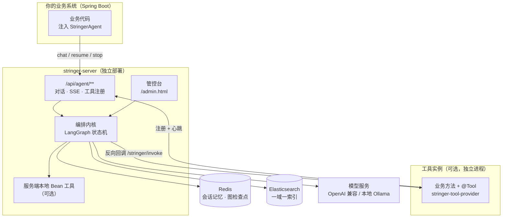
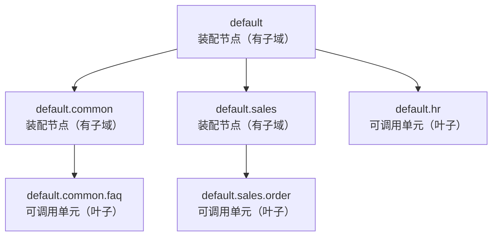
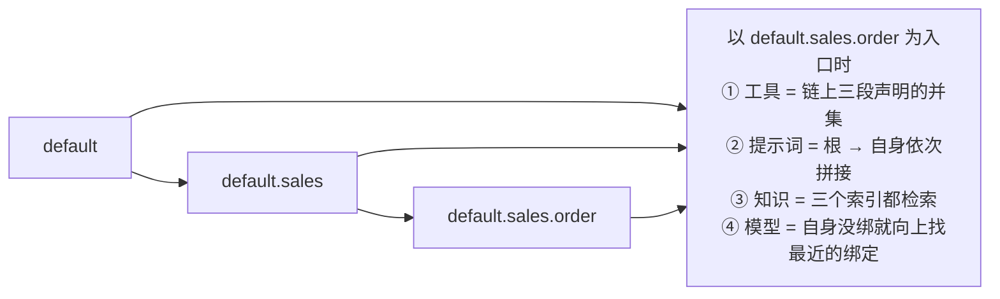
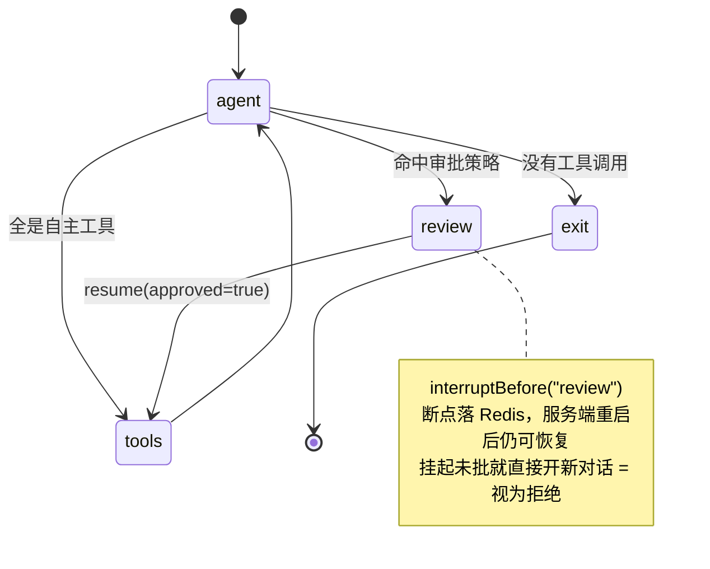

<h3 align="center">Stringer</h3>

<p align="center">
  <strong>Java 生态的 AI Agent 运行时中间件。<br>按需引 starter：注入 StringerAgent 就能调 AI，方法上加 @Tool 就能让 AI 调你，引知识库 SDK 就能传文档。编排、工具治理、知识库、管控台都在服务端。</strong>
</p>

<p align="center">
  
  
  
  
</p>

<p align="center">
  
  
  
  
</p>

<p align="center">
  <a href="#能力对比">能力对比</a>
  &nbsp;·&nbsp;
  <a href="#核心设计域与装配">核心设计</a>
  &nbsp;·&nbsp;
  <a href="#快速开始">快速开始</a>
  &nbsp;·&nbsp;
  <a href="#适合谁--不适合谁">适合谁</a>
  &nbsp;·&nbsp;
  <a href="#文档">文档</a>
</p>

---

## 能力对比

只列**有差异**的维度；共性能力（对话、流式、多模型接入）不再赘述。

| 能力 | 用 LangChain4j / Spring AI 自己搭 | 用平台（Dify / FastGPT） | Stringer |
| --- | --- | --- | --- |
| 工具怎么来 | 写代码注册，参数 schema 自己定义 | 平台侧：导入 OpenAPI / 装插件 / 连 MCP | **给方法加 `@Tool`**，参数 schema 由方法签名推导 |
| 工具跑在哪 | 你的进程 | 你的服务，或平台自带插件 | **你的进程**（SDK 注册 + 反向回调）**或服务端进程**（本地 Bean，进程内直调） |
| 域与装配 | 无此概念，权限维度自己设计 | 隔离粒度是「应用 / 工作流」 | **域树 + 两种角色 + 四维度沿链累加**：父域把工具 / 提示词 / 模型 / 知识配给后代 |
| 人工审批 | 自己实现中断、持久化与恢复 | 编排层自行安排 | `@Tool(approval=...)` **声明即生效**；断点落 Redis，服务端重启后可恢复 |
| 多实例工具治理 | 无 | 无（平台侧是插件市场） | **注册中心**：整包上报、掉线自动摘除、重连自动恢复、单实例静音 / 强制下线 |
| 知识库检索 | 自己接向量库、自己写召回与融合 | 平台内置 | **一域一索引 + 域链检索**；单索引走分数制、多索引自动切 RRF |
| 会话记忆 | 自己实现 | 平台内置 | 双约束（条数 + token 估算）按 `(域, sessionId)` 隔离；到上限**显式拒绝**，不静默丢历史 |
| 管控与运维 | 无，自己写 | 平台自带界面 | 8 页管控台（域空间 / 在线实例 / 知识库 / 提示词…）+ 运行指标快照 |
| 技术栈 | Java（库，随业务进程） | 独立平台（Python 为主） | Java 21 / Spring Boot，与业务同栈 |

- **新项目**：直接用 Stringer 当底座——编排、审批、工具注册中心、知识库、管控台第一天就有，不用先造一层。
- **已有项目**：加依赖、注入 `StringerAgent`、给现成的 `@Service` 方法加个 `@Tool` 注解即可，不必为 AI 重构现有代码。

> 竞品两列描述的是撰写时的主流形态，用于快速定位差异；具体能力以其当前文档为准。

## 核心能力

| 能力 | 具体到能做什么 |
| --- | --- |
| **图编排状态机** | 每一步显式可控（`agent → 条件路由 → tools/review → agent`），状态透明、可中断、可恢复 |
| **人工审批（HITL）** | 工具声明审批策略后，调用前自动中断等待确认；中断点落 Redis，**服务端重启后仍可恢复** |
| **域与装配** | 一次对话必须声明所处的域，模型只能看到该域的工具、只能拿到该域的提示词。域是一棵树，父域把**工具 / 提示词 / 模型 / 知识**四样东西配给后代（详见[核心设计](#核心设计域与装配)） |
| **远程工具注册中心** | 工具实例周期整包上报声明，服务端按实例维护副本；实例掉线自动摘除、重连自动恢复，同名工具多实例可同时在线 |
| **实例可用性管控** | 在线实例页可对单个实例**静音（熔断）/ 恢复 / 强制下线**：静音即摘除该实例上报的全部工具副本，不必去改动它所在的进程；强制下线的实例会收到 410 并停止心跳 |
| **混合检索（双轨融合）** | 向量与关键词两路并行召回后融合重排。结果只来自**单张索引**走**分数制**（归一化加权，标题 / 文件名命中的是乘法增益）；沿父域链取到**多索引**时自动切到 **RRF 排名制**——BM25 的分跨索引不可比，只有看名次才不失真。RRF 按模态均摊权重并做层级衰减（本域自有知识优先于从祖先继承的） |
| **一域一索引的知识库** | 每个域一个独立 ES 索引（按需创建），检索域 D 只查「D + 全部祖先」链上的索引，与工具可见性同一套累加语义；删域即删索引。管控台按域上传（默认 `txt` / `md` / `markdown` / `docx` / `doc` / `pdf` / `xls` / `xlsx`，白名单可配）、查看导入状态、整库重建；ES 缺 IK 分词器会在「存储配置」的测试连接里判读出来（可用 / 确认未安装 / 未探测三态） |
| **双约束会话记忆** | 同时约束消息条数与 Token 估算，按 `(域, sessionId)` 隔离存在 Redis；**只增不淘汰**——到上限后该会话拒绝新一轮（`30004`），由调用方更换 `sessionId` |
| **流式输出与中断** | 事件流逐帧下发；任务可随时停止 |
| **内置管控台** | 8 页：概览、模型设置、存储配置、域空间、在线实例、提示词设定、知识库、账号 |
| **运行指标快照** | `GET /admin/metrics` 返回注册工具数、运行中会话数、堆内存与内核指标快照，可接进现有监控采集（管理面，需凭证） |
| **零配置可启动** | 未填 ES / Redis / 模型也能启动，缺配置只在**调用时**报明确错误并指向该去哪一页填 |

## 架构总览



三种角色各就各位：

- **业务系统**只引 `stringer-chat-client`（要传文档再加 `stringer-kb-client`），通过 `StringerAgent` 调用，不用拼 HTTP。
- **工具放哪都行**：留在业务进程里（引 `stringer-tool-provider`，心跳注册），或者直接放进服务端进程（本服务端扫描本地 `@Tool` Bean）。**同一段注解代码在两种形态间搬迁不用改一个字。**
- **服务端**是唯一有状态的一方：编排、检查点、工具注册表、知识库索引、管控台都在它这儿。

## 核心设计：域与装配

这是 Stringer 与"直接调模型 API"最本质的差别，也是用错代价最大的地方。

**域（domain）＝一次对话的场景**，它同时决定四件事：模型能看到哪些工具、用哪份系统提示词、能检索到哪些知识、走哪个模型。

域是一棵树，标识是**从根域 `default` 出发的完整路径**（点分，如 `default.sales.order`）。主键与展示同形，因此不存在"同名不同父"的歧义。

### 两种角色：可调用单元 / 装配节点



注意每个节点的标识都是**父路径再加一段**：`default.common.faq` 挂在 `default.common` 下，而 `default.sales` 挂在 `default` 下（不是挂在 `default.common` 下）—— 标识本身就是路径，不存在"同名不同父"。

**只有叶子域可以作为可调用单元** —— 一个域一旦有了子域，就降级为装配节点。根域也不例外：整棵树只有根域时它可调用，一旦往下建了子域，它同样只是装配节点。

上图中 `default`、`default.common`、`default.sales` 都有子域，所以三者都是装配节点、都不能当入口；能作为入口的只有三个叶子：`default.common.faq`、`default.sales.order`、`default.hr`。

- **可调用单元**（叶子）：能作为入口，`chat` 时传的就是它。
- **装配节点**（有子域）：**不能当入口**，只把工具 / 提示词 / 模型 / 知识传给后代。传它做入口会返回 `10010`（"该域不是可调用单元"），而不是悄悄降级。
- 需要"某一层整体"的入口时，**另建一个没有子域的域**，而不是把父域本身变成入口。
- 这条约束在**读取时派生**（`显式标记 ∧ 无子域`），所以无论标记从管控台、工具声明派生还是历史落盘文件来，都越不过去。

域不存在报 `10004`，不是可调用单元报 `10010`，**绝不静默降级成全量工具**。

### 装配：四样东西沿祖先链累加

子域天然继承父域的能力，公共内容只需在根域写一次。



（`default.sales.order` 在这棵树里是叶子，所以它能作为入口；`default` 与 `default.sales` 有子域，只参与装配。）

四个维度用的是**同一套沿链累加语义**：

| 维度 | 装配规则 |
| --- | --- |
| 工具可见性 | **累加**：工具声明命中该域**或它的任一祖先**即可见。挂在父域上的工具，其全部后代都能用 |
| 系统提示词 | 从根到自身**依次拼接** |
| 模型绑定 | 自身没绑就**向上找最近的**绑定 |
| 知识库 | 检索「自身 ∪ 全部祖先」链上的索引 |

### 关键：域声明留空意味着什么

**留空＝挂在根域 `default`；而根域在每个域的祖先链上，所以留空＝全树可见。**

| 工具声明 `domains` | 在域 `default` 中 | 在域 `default.sales` 中 | 在域 `default.sales.order` 中 |
| --- | --- | --- | --- |
| 留空（挂根域） | ✅ | ✅ | ✅ |
| `{"default.sales"}` | ❌ | ✅ | ✅ |
| `{"default.sales.order"}` | ❌ | ❌ | ✅ |

（可见性是**按域计算**的；某一轮对话实际能用哪个域，还受上面的叶子规则约束——只有叶子域能作为入口。）

想收紧可见性，就**显式写完整路径**。**没有通配写法**（`{"*"}` 不是合法域路径，写了会导致工具注册整体被拒）。

> ⚠️ 域标识必须是**完整路径**：`default.customer` 合法，`customer` 不合法。
> 本地 `@Tool(domains=...)` 写了非法路径会**启动失败**，工具实例 manifest 写了非法路径会**整包被拒**——都是刻意的 fail-fast，而不是静默忽略。

### 域的三个来源与生命周期

| 来源 | 怎么来的 | 生命周期 |
| --- | --- | --- |
| `BUILTIN` | 内置根域 `default` | 不可删；调用未指定域时归一化到它。但它同样服从叶子规则——有子域时它只是装配节点，此时"未指定域"会返回 `10010` |
| `MANUAL` | 管控台「域空间」人工创建 | 落盘 `config/domains.json`，重启仍在 |
| `DERIVED` | 工具声明了它（写下 `domains` 即创建） | 重启后随声明重建 |

三者**同级，不构成等级**，差异只在生命周期。登记时**沿链补齐**缺失的祖先，不留悬空节点；删除**递归**带走全部子孙（不向上提升层级）。

> 域是**调用方自行声明、平台信任**的治理机制——用于防止模型误用工具、防止提示词与工具集错位，**不是安全边界**。用哪个域由客户端决定，平台无法验证真伪；终端用户的身份与授权属于宿主自己的 IAM。

## 一次对话发生了什么



1. `agentNode` 注入系统提示词 + **本轮域可见的工具集**，调流式模型，逐帧下发 `TOKEN`。
2. 无工具调用 → 结束；**全是自主工具** → 直连 `tools` 执行；**命中审批策略** → 路由到 `review` 并**中断**。
3. 中断时下发 `INTERRUPT` 事件（带待审批工具清单），断点写入 Redis。
4. 调用方 `resume(sessionId, true)` → 继续执行工具 → 回到 `agent` 汇总。

SSE 事件类型：`TOKEN` / `TOOL_CALL` / `TOOL_RESULT` / `INTERRUPT` / `STOPPED` / `ERROR` / `DONE`。

## 快速开始

### 环境要求

- JDK 21+、Maven 3.8+
- Elasticsearch 9.x（已验证；8.x 可用；更低版本需自行验证）—— 需安装 IK 分词器插件
- Redis 6+
- 一个 OpenAI 兼容的模型服务（对话模型 + 向量模型）

> ES / Redis **可与业务系统共用同一套实例**：数据层通过私有命名空间隔离（Redis key 统一 `stringer:` 前缀、ES 索引统一 `stringer_` 前缀），双方各自建立独立连接，互不影响。

模型服务只要是 **OpenAI 兼容端点**就行，公有云与本地部署没有区别——**本机 Ollama 直接可用**：

| 「模型设置」页字段 | 本机 Ollama 的填法 |
| --- | --- |
| 对话 · 服务商地址 | `http://localhost:11434/v1`（**必须带 `/v1`**） |
| 对话 · API Key | 任意非空值，如 `ollama`（Ollama 不校验，但本系统要求该字段非空） |
| 对话 · 模型名 | `qwen2.5:7b`、`llama3.1:8b` 等本地已有模型；地址填对后下拉可直接拉到列表 |
| 向量 · 模型名 | `nomic-embed-text`、`bge-m3` 等 |
| 向量 · 维度 | **留空**：Ollama 的 `/v1/embeddings` 不接受 OpenAI 的 `dimensions` 参数，填了会被忽略 |

两点提醒：

- **对话模型需支持工具调用（function calling）**（如 `qwen2.5`、`llama3.1`）。不支持时 Agent 仍能对话，但不会调用你注册的工具。
- 换了向量模型、维度随之一变时，ES 索引的维度是建索引时定死的，需在「知识库」页**重建索引**；服务端跑在容器里时 `localhost` 指容器自身，要写宿主地址。

### 第一步：启动服务端

```bash
# 方式一：直接跑（开发时用）
mvn -pl stringer-server -am install
mvn -pl stringer-server spring-boot:run          # 默认端口 9527

# 方式二：打成 fat jar 跑（部署时用；平台无关的单文件产物）
mvn -DskipTests package
java -jar stringer-server/target/stringer-v1.0-beta.1.jar
```

**不需要预先准备配置文件。** 服务端在未配置状态下即可启动（只跳过需要依赖的动作，不阻断启动），启动后打开管控台填写：

```
http://localhost:9527/admin.html      # 默认账号 stringer / stringer
```

依次在「模型设置」填对话模型与向量模型、「存储配置」填 ES 与 Redis（每页都有"测试连接"，填完可当场验证）。

> 配置从 yaml 搬到管控台是刻意的：连接信息与密钥不随源码、镜像分发，且在依赖不可用时仍能进管控台改回来。落盘位置 `config/*.json`，与源码分离。

### 第二步：接入你的应用

```xml
<!-- 对话：只要"能问 AI"就引这个 -->
<dependency>
    <groupId>com.zzkingcc</groupId>
    <artifactId>stringer-chat-client</artifactId>
    <version>v1.0-beta.1</version>
</dependency>

<!-- 知识库：要把文档传进去就再引这个（与对话相互独立） -->
<dependency>
    <groupId>com.zzkingcc</groupId>
    <artifactId>stringer-kb-client</artifactId>
    <version>v1.0-beta.1</version>
</dependency>
```

> **三个坐标，按需引入。** `stringer-chat-client` 只做对话（`StringerAgent`，用 `StringerAgentFactory.forDomain(...)` 取）；`stringer-kb-client` 只做知识库（上传 / 列表 / 删除）；`stringer-tool-provider` 只做工具注册（把本进程的方法作为工具交给 Agent，需显式打开 `stringer.tools=true`）。WebClient / 凭证 / 启动探测是三者共用的底座，同时引入也只装配一份；Web 容器不在其中——宿主原有的 Spring MVC / WebFlux 栈保持不变即可。详见[实例文档 §1.1](docs/INSTANCE.md#11-按需要引几个依赖)。

```yaml
stringer:
  server: http://localhost:9527   # 对话 SDK / 知识库 SDK / 工具实例共用这一份
  username: stringer              # 服务端改过密码后需同步
  password: stringer
```

> **服务端必须先启动**（与 Redis / Nacos 的接入习惯一致）。引入 starter 的应用在启动完成前会换取签名凭证并探测服务端健康状态，连不上或账号密码错误会**直接中断启动**并给出排查提示——不提供关闭开关：允许应用先于中间件启动，等于让它在必然不可用的状态下对外服务。
>
> 凭证不设有效期，正常路径下登录只发生一次；服务端改过密码后客户端会自动重登一次，仍失败则中断启动并提示原因。

### 第三步：注入一个 Bean，问一句话

SDK 只提供一个入口 `StringerAgent`：**先绑域，再调用**。

```java
@Service
public class MyService {
    private final StringerAgent agent;                 // 已绑定域，可缓存复用、线程安全

    public MyService(StringerAgentFactory factory) {   // starter 自动装配，不需要任何注解
        this.agent = factory.forDomain("default.customer");   // 必须是叶子域的完整路径；null / 空白会归一化到根域
    }

    /** 只要最终答案（大多数场景）：内部把 TOKEN 增量拼成整段文本 */
    public String ask(String sessionId, String question) {
        return agent.ask(sessionId, question);
    }

    /** 要逐字输出 */
    public Flux<String> stream(String sessionId, String question) {
        return agent.stream(sessionId, question);
    }

    /** 要完整事件流（工具调用 / 审批中断 / 错误码） */
    public Flux<AgentEvent> events(String sessionId, String question) {
        return agent.events(sessionId, question);
    }
}
```

命中人工审批时 `ask` / `stream` 抛 `ApprovalRequiredException`（带待审批工具清单），用户确认后 `agent.resume(sessionId, true)` 继续。

三个方法的签名里都**没有域参数**，所以"忘传域"写不出来——域在取得门面时就绑定了，同一域永远拿到同一个门面。

### 第四步：方法上加个注解，把业务方法变成工具

引入 `stringer-tool-provider` 并打开 `stringer.tools=true`，然后在任意 Spring Bean 的方法上声明：

```java
// 只读工具：客服域可见，参数 schema 由方法签名推导
@Tool(desc = "按订单号查询订单状态。用户追问发货/物流时调用",
        value = "queryOrder", domains = {"default.customer"})
public String queryOrder(@ToolParam("订单号，如 FR2024001") String orderNo) { ... }

// 写操作：声明副作用等级 + 调用前中断等人工确认
@Tool(desc = "按订单号退款。仅在用户明确要求退款时调用",
        value = "refundOrder", domains = {"default.customer", "default.finance"},
        effect = Tool.Effect.WRITE,
        approval = Tool.Approval.ALWAYS, approvalReason = "退款会真实出金，需人工确认")
public String refundOrder(@ToolParam("订单号") String orderNo,
                          @ToolParam("退款金额，单位：元，须 ≤ 订单实付") BigDecimal amount) { ... }
```

方法签名即参数 schema、注解即治理策略、方法体即执行逻辑——三件事写在同一个地方。更多注解与对话 SDK 的完整示例（参数 DTO、`@ToolDomains`、`@ToolAdvanced`、审批恢复、SSE 裸调）见 [SDK 使用手册](docs/SDK-USAGE.md)。

工具清单需要在启动期动态拼装时，改用 `ToolInstanceContributor` 编程式注册（重名以编程式为准），见[实例文档 §4.4](docs/INSTANCE.md#44-声明工具编程式工具清单要在启动期动态拼装时用)。

## 适合谁 / 不适合谁

**适合**：Java 团队（新项目或已有项目）不想为 AI 另起一套技术栈；工具无论集中在一个进程里、还是分散在多个服务中，都需要统一注册与治理；需要域维度的能力隔离（多租户、多业务线共用一套 Agent）；有 on-prem、数据不出域或信创要求；需要人工审批介入高风险操作（退款、改单、群发）；需要知道「现在有哪些工具、哪些实例在线」。

**不适合**：以可视化拖拽为主的低代码搭建；纯 Python 技术栈；单机脚本级的一次性调用。

## 部署形态

服务端是**平台无关的单文件 fat jar**：一份构建产物，在 Linux、Windows、macOS（含其他 Unix 类）上直接 `java -jar` 即可运行，无需为目标系统重新构建。

- **启动期自动探测运行系统**：`RuntimeEnvironment` 在 Spring 装配前用 `System.getProperty("os.name")` 判定 OS 族，自动选定配置 / 日志 / 切片导出目录并提前建好。
  - Linux / 其他 Unix：`/var/lib/stringer/config`、`/var/log/stringer`、`/var/lib/stringer/chunks`
  - Windows：`%ProgramData%\Stringer\config`、`%ProgramData%\Stringer\logs`、`%ProgramData%\Stringer\chunks`
  - macOS：`/Library/Application Support/Stringer/config`、`/Library/Logs/Stringer`、`/Library/Application Support/Stringer/chunks`
- **覆盖优先级**：命令行 `--key` ＞ JVM 系统属性 `-Dkey` ＞ 环境变量 `STRINGER_SETTINGS_PATH` / `STRINGER_LOG_PATH` / `STRINGER_EXPORT_PATH` ＞ 平台默认。
- **容器部署**：Docker / K8s 只需换对应基底镜像（如 `eclipse-temurin:21-jre`），jar 不变；容器运行时（kubernetes / docker / podman）会在启动横幅中显示，便于排障。

> ⚠️ **当前只支持单实例部署。** 会话占用闸门、停止标志、流注册表都在进程内存里，多实例共用同一个 Redis 会**不报错地**产生错误结果（同一会话丢更新、`stop` 停不掉真正在跑的任务）。服务端启动时会在 Redis 上抢一个运行权租约，抢不到就**拒绝启动**；纵向扩容（加 CPU / 内存 / 提高线程池）是当前唯一受支持的扩容方式。详见[部署手册 §6](docs/DEPLOYMENT.md)。

## 模块结构

| 模块 | 说明 |
| --- | --- |
| `stringer-api` | 对外契约：`StringerAgent` / 注解 / 事件 / 工具描述符 / 错误码 |
| `stringer-common` | 公共支撑：异常体系 / 输入安全 |
| `stringer-domain` | 领域能力：知识检索 / 混合检索与融合排序 / 记忆策略 |
| `stringer-infrastructure` | 基础设施：ES 检索与索引管理 / 文档摄取切片 / Redis / 向量化 |
| `stringer-runtime` | Agent 运行时内核：图编排 / 工具注册表与路由 / 实例注册表 / 流式上下文 / 提示词解析 / 取消 / 模型解析 / 域注册表 |
| `stringer-server` | **服务端**：可独立部署，承载全部重逻辑与管控台 |
| `stringer-sdk-core` | SDK 公共层：对外契约 + 公共异常 + 服务端连接配置（随 SDK 传递，接入方不直接引） |
| `stringer-client-core` | SDK 客户端底座：WebClient / 凭证换取 / 错误翻译 / 启动期探测，被对话与知识库两个 SDK 共用 |
| `stringer-chat-client` | **对话 SDK**：`StringerAgent`（`forDomain` → `ask`/`stream`/`events`/`resume`/`stop`） |
| `stringer-kb-client` | **知识库 SDK**：文档上传 / 列表 / 删除，按域落到对应索引 |
| `stringer-tool-provider` | **工具 SDK**：注册与心跳保活 + 工具调用端点，只依赖契约层，不含内部实现 |

## 接口

业务系统通过 `StringerAgent` 调用，无需拼 HTTP；需要裸 HTTP 时看这几个：

| 方法 | 路径 | 说明 |
| --- | --- | --- |
| POST | `/api/agent/login` | 账号密码换签名凭证（免鉴权） |
| GET | `/api/agent/health` | 健康探测 |
| POST | `/api/agent/chat` | 发起对话，SSE 返回事件流 |
| POST | `/api/agent/resume` | 恢复因审批而中断的会话 |
| POST | `/api/agent/stop/{sessionId}` | 停止执行中的任务 |
| POST | `/api/agent/tools/register` | 工具实例注册与心跳 |

管控台调用的管理面（`/admin/*`：设置、模型、域空间、实例静音与下线、知识库上传与重建、指标快照、账号）不在上表内，完整端点、SSE 事件契约、错误码总表、SDK 用法见 [API 文档](docs/API.md)。

## 文档

- [设计文档](docs/DESIGN.md) —— 形态与模块、域与工具可见性、工具体系、存储与模型配置、并发模型、配置项总表
- [API 文档](docs/API.md) —— 全部 HTTP 端点、SSE 事件契约、错误码总表、starter 与工具实例 SDK
- [实例文档](docs/INSTANCE.md) —— 配置与接入实操：服务端配置、客户端 starter 接入、工具实例 SDK、本地 Bean 工具、域机制、端到端跑通
- [SDK 使用手册](docs/SDK-USAGE.md) —— 注解与对话 SDK 的可复制示例：最小工具、`@ToolParam`/`@ToolDomains`/`@ToolAdvanced`、审批恢复、事件流、SSE 裸调
- [部署手册](docs/DEPLOYMENT.md) —— 落盘目录、单实例契约、Redis 容量硬要求、升级与备份
- [TXT 入库清洗与切片设计](docs/TXT-INGESTION-DESIGN.md) —— 编码探测、页眉页脚识别与清洗、结构推断、预算打包、切片元数据契约、质量验证
- [md / docx / doc / pdf / excel 入库切片设计](docs/MULTI-FORMAT-INGESTION-DESIGN.md) —— 格式适配层与通用切片层的拆分、Block 中间表示、表格与图片策略、PDF 页眉页脚与跨页拼接
- [多模型网关设计](docs/MULTI-LLM-DESIGN.md) —— 模型档案 schema、域绑定与沿链回落、指纹缓存与降级链（历史评审稿，结论已并入设计文档）
- [踩坑记录](docs/PITFALLS.md) —— 反直觉取舍、易错点与失败模式

## License

[Apache-2.0](LICENSE)
